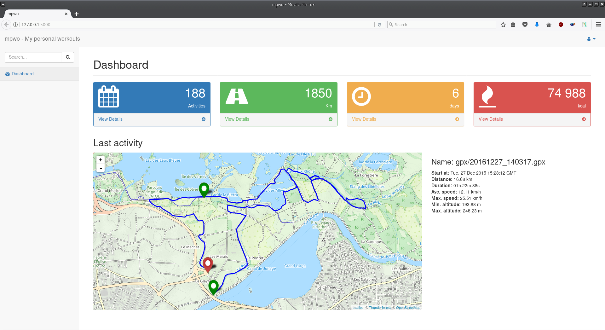

# mpwo

Self hosted workout/activity tracker written in Python.  

  
Based on :
- [Flask](http://flask.pocoo.org)
- [Leaflet.js](http://leafletjs.com/) and [leaflet-gpx](https://github.com/mpetazzoni/leaflet-gpx) plugin
- [Bootstrap](https://startbootstrap.com/) and [SB Admin v2](https://startbootstrap.com/template-overviews/sb-admin-2/) theme

## Prerequisites
- Python 3 (tested with 3.6 (on Manjaro))
- Flask
- [PyYAML](http://pyyaml.org)  
- [gpxpy](https://github.com/tkrajina/gpxpy) -- GPX file parser

_!! work in progress !!_