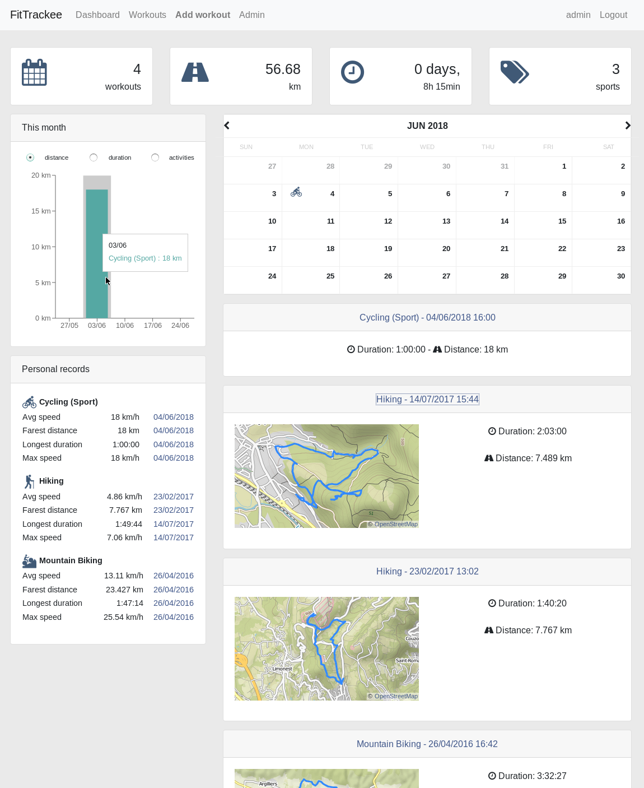
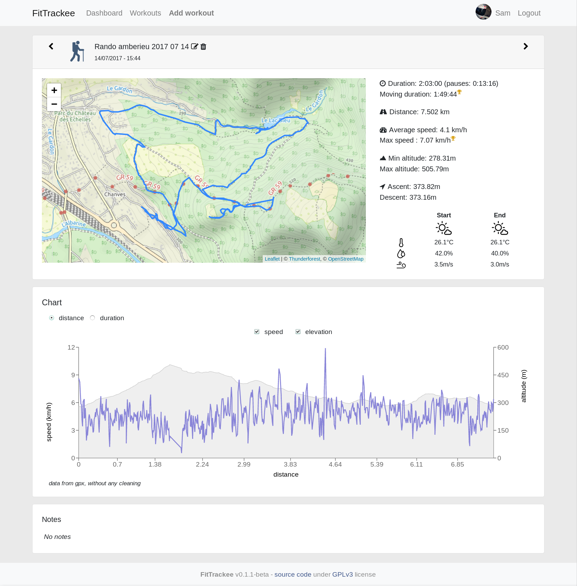
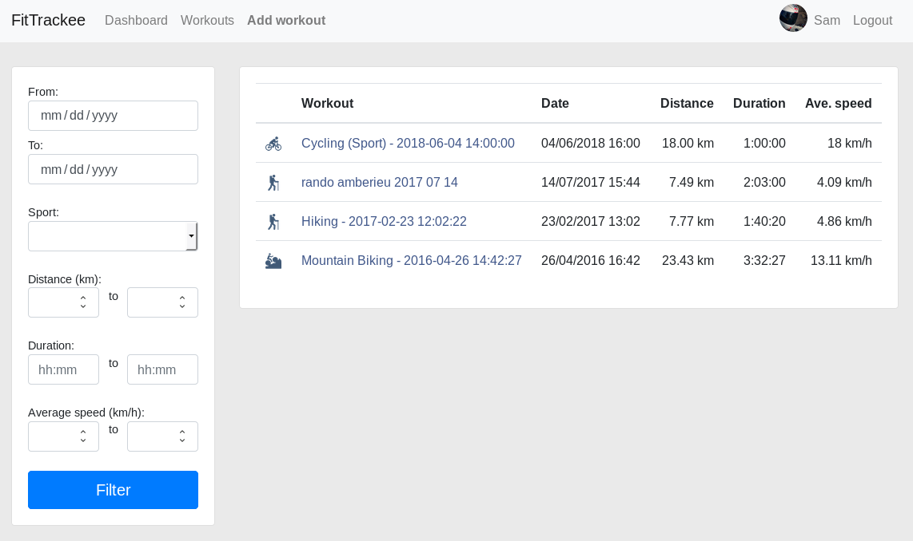

# FitTrackee
**A simple self-hosted workout/activity tracker.**  

 
  

1

---

This web application allows you to track your outdoor activities from gpx files and keep your data on your own server.  
No mobile app is developed yet, but several existing mobile apps can store workouts data locally and export them into a gpx file.  
Examples (for Android):  
* [Runner Up](https://github.com/jonasoreland/runnerup) (GPL v3)  
* [ForRunners](https://gitlab.com/brvier/ForRunners)  (GPL v3)  
* [AlpineQuest](https://www.alpinequest.net/) (Proprietary, no trackers according to [exodus privay report](https://reports.exodus-privacy.eu.org/reports/2975/))  

Maps are displayed using [Open Street Map](https://www.openstreetmap.org).  
It is also possible to add a workout without a gpx file.

**Still under development (not ready for production).**  
(see [issues](https://github.com/SamR1/mpwo/issues) and [wiki](https://github.com/SamR1/mpwo/wiki) for more informations)  

---

Notes:  
_1. Test coverage: only for Python API_
