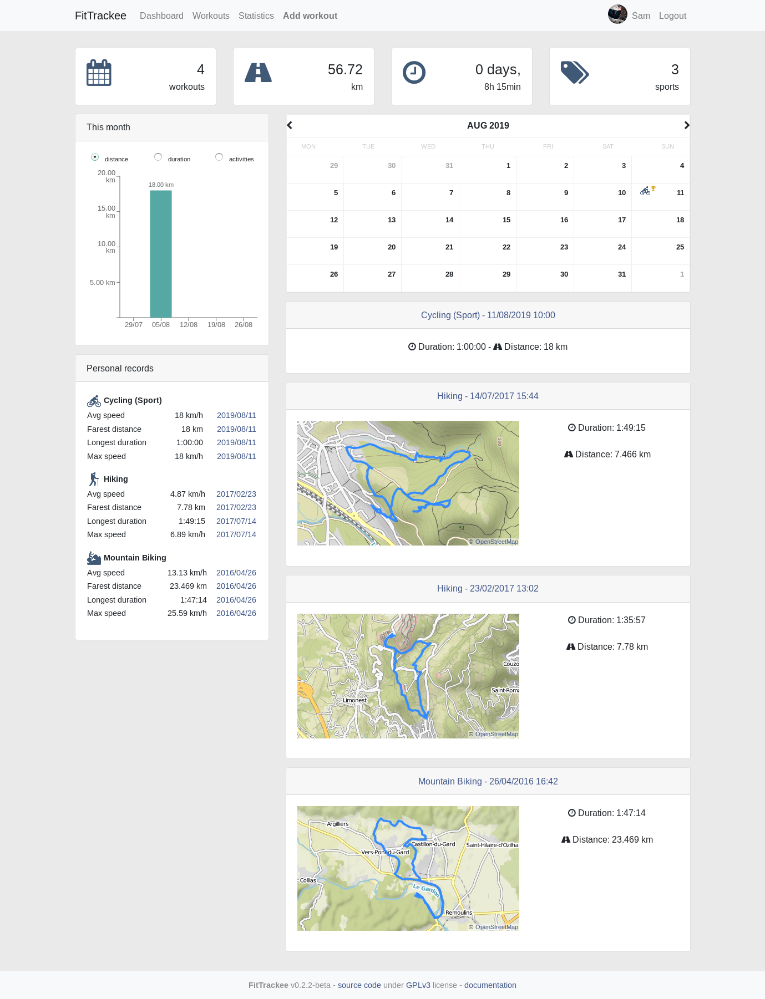

.. FitTrackee documentation master file, created by
   sphinx-quickstart on Sun Jul 14 14:43:43 2019.

FitTrackee
==========

| |Python Version| |Flask Version| |React Version|
| |Codacy Badge| |Codacy Coverage Badge|\ 1 |Build Status|

| This web application allows you to track your outdoor activities from
  gpx files and keep your data on your own server.
| No mobile app is developed yet, but several existing mobile apps can
  store workouts data locally and export them into a gpx file.
| Examples (for Android):
| \* `Runner Up <https://github.com/jonasoreland/runnerup>`__ (GPL v3)
| \* `ForRunners <https://gitlab.com/brvier/ForRunners>`__ (GPL v3)
| \* `AlpineQuest <https://www.alpinequest.net/>`__ (Proprietary, no
  trackers according to `exodus privay
  report <https://reports.exodus-privacy.eu.org/reports/2975/>`__)

| Maps are displayed using `Open Street
  Map <https://www.openstreetmap.org>`__.
| It is also possible to add a workout without a gpx file.

| **Still under development (not ready for production).**
| (see `issues <https://github.com/SamR1/FitTrackee/issues>`__ for more information)

Table of contents
=================

.. toctree::
   :maxdepth: 2

   installation
   features
   api/index

.. |Python Version| image:: https://img.shields.io/badge/python-3.7-brightgreen.svg
   :target: https://python.org
.. |Flask Version| image:: https://img.shields.io/badge/flask-1.1-brightgreen.svg
   :target: http://flask.pocoo.org/
.. |React Version| image:: https://img.shields.io/badge/react-16.8-brightgreen.svg
   :target: https://reactjs.org/
.. |Codacy Badge| image:: https://api.codacy.com/project/badge/Grade/290a285f22e94132904dc13b4dd19d1d
   :target: https://www.codacy.com/app/SamR1/FitTrackee
.. |Codacy Coverage Badge| image:: https://api.codacy.com/project/badge/Coverage/290a285f22e94132904dc13b4dd19d1d
   :target: https://www.codacy.com/app/SamR1/FitTrackee
.. |Build Status| image:: https://travis-ci.org/SamR1/FitTrackee.svg?branch=master
   :target: https://travis-ci.org/SamR1/FitTrackee
