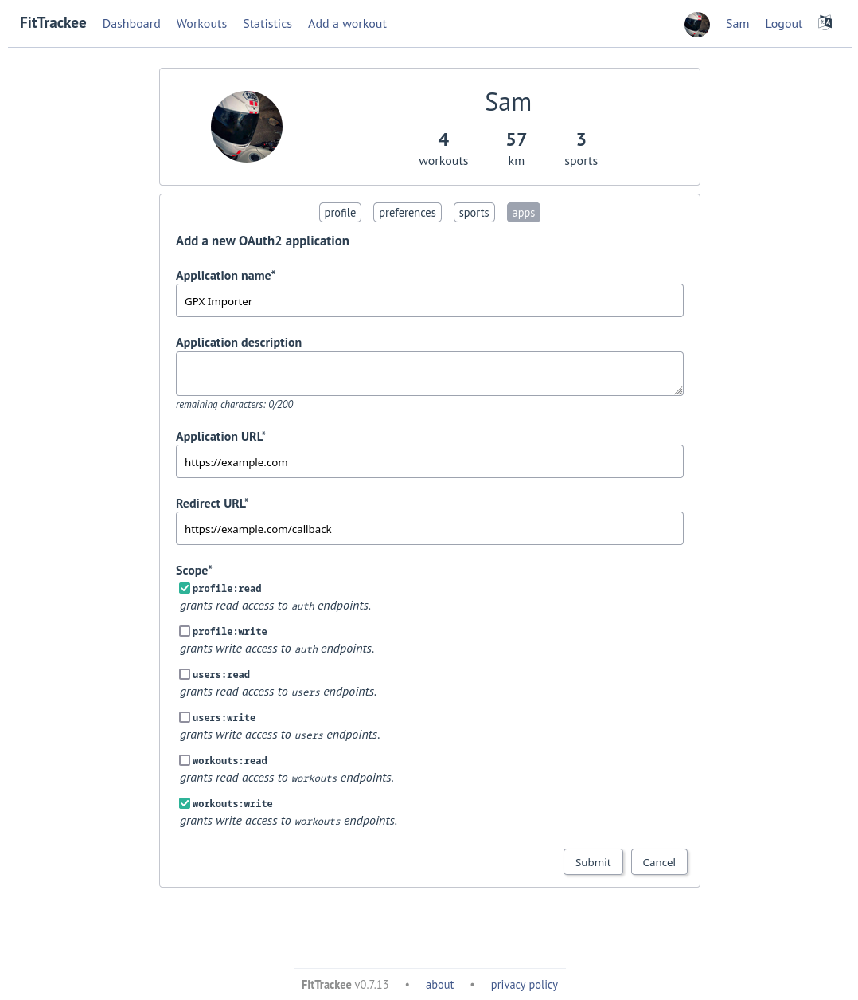

Third-party applications
########################
(*new in 0.7.0*)

FitTrackee provides a REST API (see `documentation <api/index.html>`__) whose
most endpoints require authorization/authentication.

To allow a third-party application to interact with API endpoints, an
`OAuth2 <https://datatracker.ietf.org/doc/html/rfc6749>`_ client can be created
in user settings ('apps' tab).

.. warning::
  OAuth2 endpoints requiring authentication are not accessible by third-party
  applications (`documentation <api/oauth2.html>`__), only by FitTrackee
  client (first-party application).

FitTrackee supports only `Authorization Code <https://datatracker.ietf.org/doc/html/rfc6749#section-1.3.1>`_
flow (with PKCE support).
It allows to exchange an authorization code for an access token.
The client ID and secret must be sent in the POST body.
It is recommended to use `PKCE <https://datatracker.ietf.org/doc/html/rfc7636>`_
to provide a better security.

The following scopes are available:

- ``application:write``: grants write access to application configuration (only for users with administration rights),
- ``profile:read``: grants read access to auth endpoints,
- ``profile:write``: grants write access to auth endpoints,
- ``users:read``: grants read access to users endpoints,
- ``users:write``: grants write access to users endpoints,
- ``workouts:read``: grants read access to workouts-related endpoints,
- ``workouts:write``: grants write access to workouts-related endpoints.

.. note::
  OAuth2 support is implemented with `Authlib <https://docs.authlib.org/en/latest/>`_ library.

.. warning::
  | If FitTrackee is running behind a proxy, the ``X-Forwarded-Proto`` header must be set.
  | For instance for `nginx`:

  .. code-block::

     proxy_set_header  X-Forwarded-Proto $scheme;

Some resources about OAuth 2.0:

- `OAuth 2.0 Simplified <https://www.oauth.com>`_ by `Aaron Parecki <https://aaronparecki.com>`_
- `Web App Example of OAuth 2 web application flow <https://requests-oauthlib.readthedocs.io/en/latest/examples/real_world_example.html>`_ with Requests-OAuthlib (python)
- `OAuth 2 Session <https://docs.authlib.org/en/latest/client/oauth2.html#oauth-2-session>`_ with Authlib (python)
- `Minimal example of an application interacting with FitTrackee <https://codeberg.org/SamR1/ft-oauth-client>`_ (python)