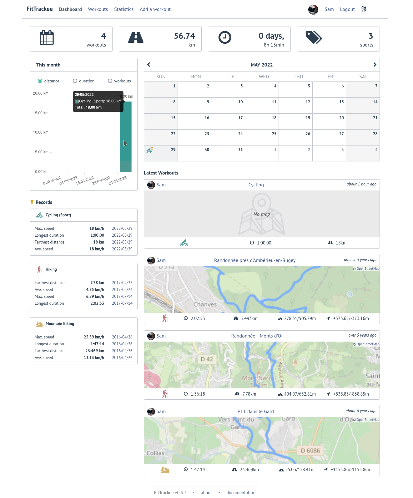
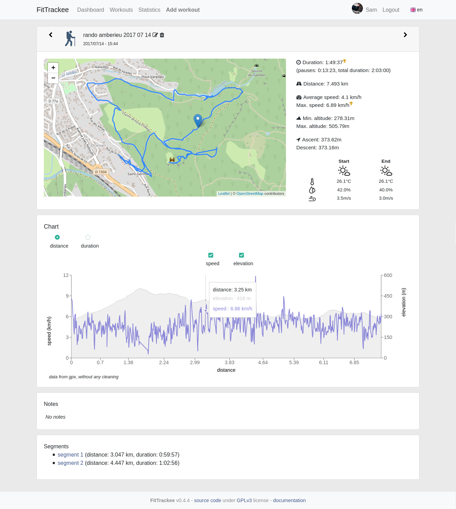
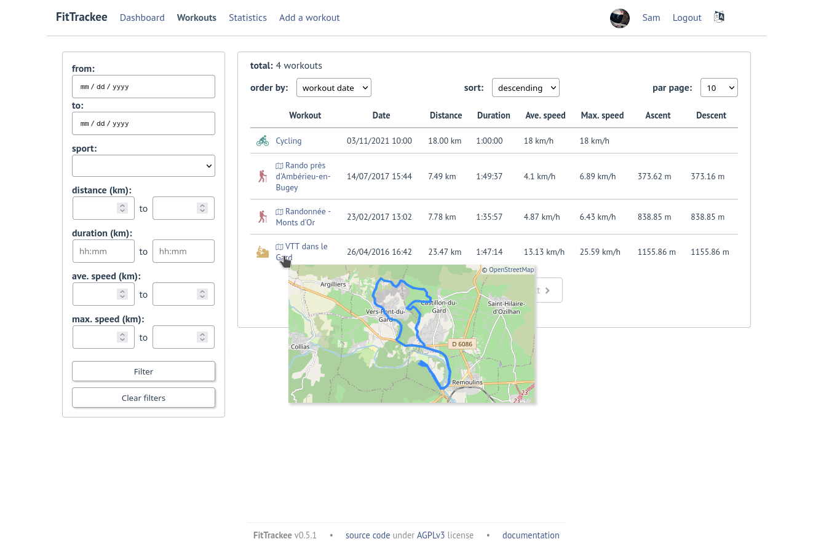
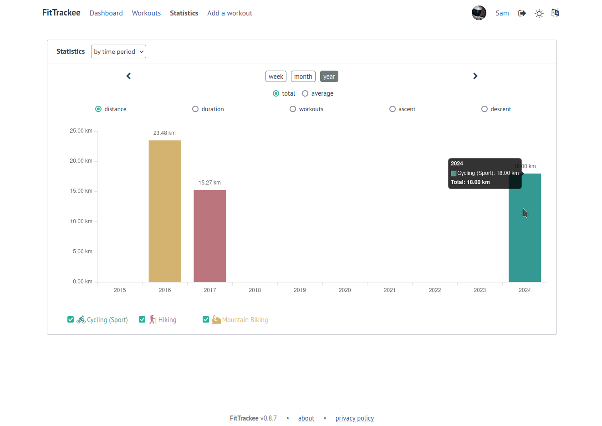
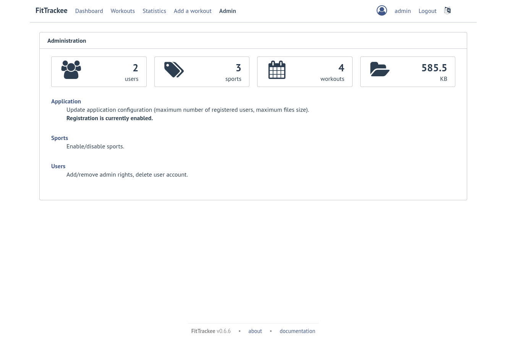
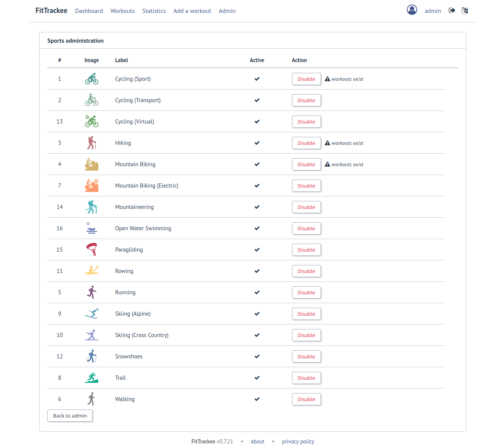

Features
########

| **FitTrackee** allows you to store and display gpx files and some statistics from your outdoor activities.
| For now, this app is kind of a single-user application. Even if several users can register, a user can only view his own workouts.

Gpx files are stored in an upload directory (without encryption).

With the default configuration, `Open Street Map <https://www.openstreetmap.org>`__ is used as tile server in Workout detail and for static map generation.

Workouts
^^^^^^^^
- 14 sports are supported:
     - Cycling (Sport)
     - Cycling (Transport)
     - Cycling (Virtual)  (*new in 0.7.3*)
     - Hiking
     - Mountain Biking
     - Mountain Biking (Electric)  (*new in 0.5.0*)
     - Mountaineering  (*new in 0.7.9*)
     - Rowing  (*new in 0.5.0*)
     - Running
     - Skiing (Alpine) (*new in 0.5.0*)
     - Skiing (Cross Country)  (*new in 0.5.0*)
     - Snowshoes (*new in 0.5.2*)
     - Trail (*new in 0.5.0*)
     - Walking
- (*new in 0.5.0*) Stopped speed threshold used by `gpxpy <https://github.com/tkrajina/gpxpy>`_ is not the default one for the following sports (0.1 km/h instead of 1 km/h):
     - Hiking
     - Mountaineering
     - Skiing (Cross Country)
     - Snowshoes
     - Trail
     - Walking

.. note::
  It can be overridden in user preferences.

- Dashboard with month calendar displaying workouts and record. The week can start on Sunday or Monday (which can be changed in the user preferences). The calendar displays up to 100 workouts.
- Workout creation by uploading a gpx file (related data are stored in database with metric system).
- | A workout can even be created without gpx (the user must enter date, time, duration and distance).
  | Ascent and descent can also be provided (*new in 0.7.10*).
- | A workout with a gpx file can be displayed with map and charts (speed and elevation).
  | Controls allow full screen view and position reset (*new in 0.5.5*).
- | If **DarkSky API** or **Visual Crossing** (*new in 0.7.11*) API key is provided, weather is displayed in workout detail. Data source is displayed in About page.
  | Wind is displayed, with arrow indicating direction (a tooltip can be displayed with the direction that the wind is coming **from**) (*new in 0.5.5*).
- Segments can be displayed.
- Workout gpx file can be downloaded (*new in 0.5.1*)
- Workout edition and deletion. User can add a note.
- User statistics, by time period (week, month, year) and sport:
    - total distance
    - total duration
    - total workouts
    - total ascent  (*new in 0.5.0*)
    - total descent  (*new in 0.5.0*)
    - average speed  (*new in 0.5.1*)
- User records by sports:
    - average speed
    - farthest distance
    - highest ascent (*new in 0.6.11*, can be hidden, see user preferences)
    - longest duration
    - maximum speed

.. note::
  Records may differ from records displayed by the application that originally generated the gpx files.

- Workouts list and filter. Only sports with workouts are displayed in sport dropdown.

.. note::
    For now, only the owner of the workout can see it.

Account & preferences
^^^^^^^^^^^^^^^^^^^^^
- A user can create, update and deleted his account.
- The user must agree to the privacy policy to register. If a more recent policy is available, a message is displayed on the dashboard to review the new version (*new in 0.7.13*).
- On registration, the user account is created with selected language in dropdown as user preference (*new in 0.6.9*).
- After registration, the user account is inactive and an email with confirmation instructions is sent to activate it.
  A user with an inactive account cannot log in. (*new in 0.6.0*).

.. note::
  In case email sending is not configured, a `command line <cli.html#ftcli-users-update>`__ allows to activate users account.

- A user can set language, timezone and first day of week.
- A user can reset his password (*new in 0.3.0*)
- A user can change his email address (*new in 0.6.0*)
- A user can choose between metric system and imperial system for distance, elevation and speed display (*new in 0.5.0*)
- A user can choose to display or hide ascent records and total on Dashboard (*new in 0.6.11*)
- A user can choose format used to display dates (*new in 0.7.3*)
- A user can set sport preferences (*new in 0.5.0*):
     - change sport color (used for sport image and charts)
     - can override stopped speed threshold (for next uploaded gpx files)
     - disable/enable a sport.

.. note::
  | If a sport is disabled by an administrator, it can not be enabled by a user. In this case, it will only appear in preferences if the user has workouts and only sport color can be changed.
  | A disabled sport (by admin or user) will not appear in dropdown when **adding a workout**.
  | A workout with a disabled sport will still be displayed in the application.

- A user can create `clients <apps.html>`__ for third-party applications (*new in 0.7.0*).
- | A user can request a data export (*new in 0.7.13*).
  | It generates a zip archive containing 2 ``json`` files (user info and workouts data) and all uploaded gpx files.

.. note::
  For now, it's not possible to import these files into another **FitTrackee** instance.

Administration
^^^^^^^^^^^^^^
(*new in 0.3.0*)

Application
"""""""""""

**Configuration**

The following parameters can be set:

- active users limit. If 0, registration is enabled (no limit defined).
- maximum size of gpx file (individually uploaded or in a zip archive) (*changed in 0.7.4*)
- maximum size of zip archive
- maximum number of files in the zip archive (*changed in 0.7.4*)
- administrator email for contact (*new in 0.6.0*)

.. warning::
  Updating server configuration may be necessary to handle large files (like `nginx <https://nginx.org/en/docs/http/ngx_http_core_module.html#client_max_body_size>`_ for instance).

.. note::
  If email sending is disabled, a warning is displayed.

**About**

(*new in 0.7.13*)

| It is possible displayed additional information that may be useful to users in **About** page.
| Markdown syntax can be used.

**Privacy policy**

(*new in 0.7.13*)

| A default privacy policy is available (originally adapted from the `Discourse <https://github.com/discourse/discourse>`__ privacy policy).
| A custom privacy policy can set if needed (Markdown syntax can be used). A policy update will display a message on users dashboard to review it.

.. note::
  Only the default privacy policy is translated (if the translation is available).

Users
"""""

- display and filter users list
- edit a user to:

  - add/remove administration rights
  - activate his account (*new in 0.6.0*)
  - update his email (in case his account is locked) (*new in 0.6.0*)
  - reset his password (in case his account is locked) (*new in 0.6.0*). If email sending is disabled, it is only possible via CLI.
- delete a user

Sports
""""""
- enable or disable a sport (a sport can be disabled even if workout with this sport exists)

Translations
^^^^^^^^^^^^
FitTrackee is available in the following languages (which can be saved in the user preferences):

- English
- French (*new in 0.2.3*)
- German (*new in 0.6.9*)
- Dutch (*new in 0.7.8*)
- Italian (*new in 0.7.10*)

Translations status on `Weblate <https://hosted.weblate.org/engage/fittrackee/>`__:

.. figure:: https://hosted.weblate.org/widgets/fittrackee/-/multi-auto.svg

Screenshots
^^^^^^^^^^^^

Dashboard
"""""""""

Workout detail
""""""""""""""

Workouts list
"""""""""""""

Statistics
""""""""""

Administration
""""""""""""""

