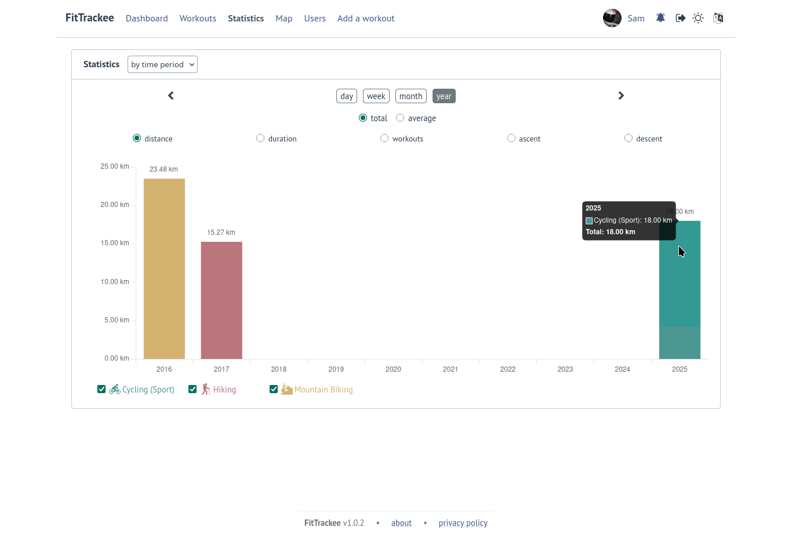
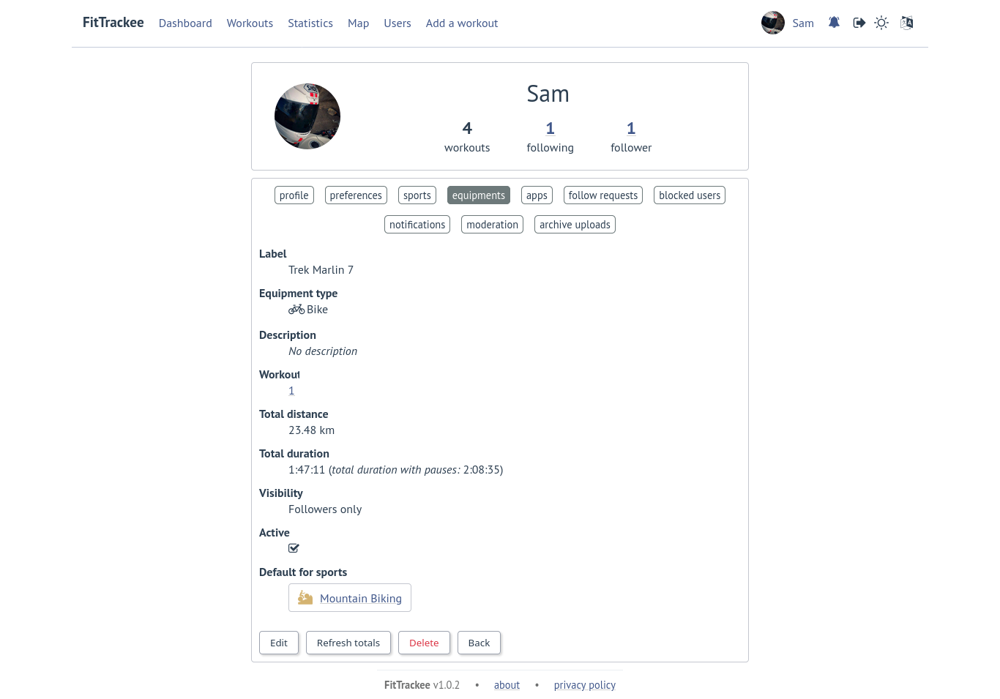
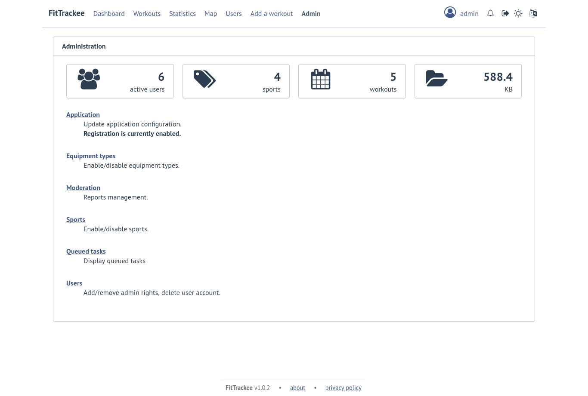

Features
########

| **FitTrackee** allows you to store and display **gpx** files and some statistics from your **outdoor** activities.
| Equipments can be associated with workouts.
| If registration is enabled, multiple users can register and interact with other users (comments, likes). Workouts and comments are visible to other users according to visibility levels.

Gpx files are stored in an upload directory (**without encryption**).

With the default configuration, `Open Street Map <https://www.openstreetmap.org>`__ is used as tile server in Workout detail and for static map generation.

Workouts
========

Sports
------

- 18 sports are supported:

  - Cycling (Sport)
  - Cycling (Transport)
  - Cycling (Trekking)  (*new in 0.7.27*)
  - Cycling (Virtual)  (*new in 0.7.3*)
  - Hiking
  - Mountain Biking
  - Mountain Biking (Electric)  (*new in 0.5.0*)
  - Mountaineering  (*new in 0.7.9*)
  - Open Water Swimming  (*new in 0.7.20*)
  - Paragliding  (*new in 0.7.19*)
  - Rowing  (*new in 0.5.0*)
  - Running
  - Skiing (Alpine) (*new in 0.5.0*)
  - Skiing (Cross Country)  (*new in 0.5.0*)
  - Snowshoes (*new in 0.5.2*)
  - Swimrun (*new in 0.8.7*)
  - Trail (*new in 0.5.0*)
  - Walking

- (*new in 0.5.0*) Stopped speed threshold used by `gpxpy <https://github.com/tkrajina/gpxpy>`_ is not the default one for the following sports (0.1 km/h instead of 1 km/h):

  - Hiking
  - Mountaineering
  - Open Water Swimming
  - Paragliding
  - Skiing (Cross Country)
  - Snowshoes
  - Swimrun
  - Trail
  - Walking

.. note::
  It can be overridden in user preferences.

.. note::
  | Except the stopped speed threshold, all sports are analyzed in the same way (no specificity taken into account for the moment).
  | Swimrun is displayed as a single activity with no difference between segments for now.

Workouts
--------

- A workout can be created by:

  - uploading manually a gpx file or a zip archive containing a limited number of gpx files,
  - | or entering date, time, duration and distance (without gpx file).
    | Ascent and descent can also be provided (*new in 0.7.10*).

.. warning::
  | Only **gpx** files with time and elevation are supported (otherwise, errors may occur on upload).

.. note::
  | Calculated values may differ from values calculated by the application that originally generated the gpx files, in particular the maximum speed.

.. note::
  | Related data are stored in database in metric system.

.. note::
  | For now, **FitTrackee** has no importer, but some `third-party tools <third_party_tools.html#importers>`__ allow you to import workouts.

- | If the name is present in the gpx file (``<name></name>``), it is used as the workout title. Otherwise, a title is generated from the sport and workout date.
  | User can add title while uploading gpx file (*new in 0.8.10*).
- | The user can add description (*new in 0.8.9*) and private notes.
  | A limited Markdown syntax can be used (*new in 0.9.0*).
- If present and no description is provided by the user, the description from the gpx file (``<desc></desc>``) is used as the workout description (*new in 0.8.10*).
- | A workout with a gpx file can be displayed with map and charts (speed and elevation (if the gpx file contains elevation data, *updated in 0.7.20*)).
  | Controls allow full screen view and position reset (*new in 0.5.5*).
- | If **Visual Crossing** (*new in 0.7.11*) API key is provided, weather is displayed in workout detail. Data source is displayed in **About** page.
  | Wind is displayed, with an arrow indicating the direction (a tooltip can be displayed with the direction that the wind is coming **from**) (*new in 0.5.5*).
- | An `equipment <features.html#equipments>`__ can be associated with a workout (*new in 0.8.0*). For now, only one equipment can be associated.
  | Equipment is only visible to workout owner.
- Segments can be displayed.
- Records associated with the workout are displayed.

.. note::
  Records may differ from records displayed by the application that originally generated the gpx files.

- Visibility level can be set separately for workout data, analysis and map (*new in 0.9.0*):

  - private: only owner can see data,
  - followers only: only owner and followers can see data,
  - public: anyone can see data even unauthenticated users.

  |
  | Workout visibility applies to title, description, records and workout data except elevation.
  | Analysis visibility applies to chart data, elevation and segments, if workout is associated with a gpx file.
  | Map visibility applies to the map, if workout is associated with a gpx file.
  |
  | Default visibility can be set in user preferences.

.. note::
  | A workout with a gpx file whose visibility for map and analysis data does not allow them to be viewed appears as a workout without a gpx file.
  | Max speed is returned regardless analysis visibility.

.. note::
  | Default visibility is private. All workouts created before **FitTrackee** 0.9.0 are private.

.. important::
  | Please keep in mind that the server operating team or the moderation team may view content with restricted visibility.

- Workout can be edited:

  - sport
  - title
  - equipment
  - description (*new in 0.8.9*)
  - private notes
  - workout visibility (*new in 0.9.0*)
  - analysis visibility (*new in 0.9.0*)
  - map visibility (*new in 0.9.0*)
  - date (only workouts without gpx)
  - duration (only workouts without gpx)
  - distance (only workouts without gpx)
  - ascent and descent (only workouts without gpx) (*new in 0.7.10*)

- Workout gpx file can be downloaded (*new in 0.5.1*).
- Workout can be deleted.
- Workouts list.

  - The user can filter workouts on:

    - date
    - sports (only sports with workouts are displayed in sport dropdown)
    - equipment (only equipments with workouts are displayed in equipment dropdown) (*new in 0.8.0*)
    - title (*new in 0.7.15*)
    - description (*new in 0.8.9*)
    - notes (*new in 0.8.0*)
    - distance
    - duration
    - average speed
    - maximum speed

  - Workouts can be sorted by:

    - date
    - distance
    - duration
    - average speed

- A user can report a workout that violates instance rules. This will send a notification to moderators and administrators.

Interactions
============

.. versionadded:: 0.9.0

Users
-----
- | Users directory.
  | A user can configure visibility in directory in the user preferences (hidden by default).
  | This affects username completion when writing comments (only profiles visible in users directory or followed users are suggested).

.. note::
    A user profile remains accessible via its URL.

- | User can send follow request to others users.
  | Follow request can be approved or rejected.
- | In order to hide unwanted content, a user can block another user.
  | Blocking users hides their workouts on timeline and comments. Notifications from blocked users are not displayed.
  | Blocked users cannot see workouts and comments from users who have blocked them, or follow them (if they followed them, they are forced to unfollow them).
- A user can report a user profile that violates instance rules. This will send a notification to moderators and administrators.

Comments
--------

- | Depending on visibility, a user can comment on a workout.
  | A limited Markdown syntax can be used.
- The visibility levels for comment are:

  - private: only author and mentioned users can see the comment,
  - followers only: only author, followers and mentioned users can see the comment,
  - public: anyone can see the comment even unauthenticated users.

.. important::
  | Please keep in mind that the server operating team or the moderation team may view content with restricted visibility.

.. note::
  | Changing workout visibility will not affect visibility of existing comments.

- Comment text can be modified (visibility level cannot be changed).
- A user can report a comment that violates instance rules. This will send a notification to moderators and administrators.

Likes
-----

- Depending on visibility, a user can like or "unlike" a workout or a comment.

Notifications
-------------

- Notifications are sent for the following event:

  - follow request and follow
  - like on comment or workout
  - comment on workout
  - mention on comment
  - suspension or warning (an email is also sent if email sending is enabled)
  - suspension or warning lifting (an email is also sent if email sending is enabled)

- Users with moderation rights can also receive notifications on:

  - report creation
  - appeal on suspension or warning

- Users with administration rights can also receive notifications on user creation.
- Users can mark notifications as read or unread.

Dashboard
=========

- A dashboard displays:

  - a graph with monthly statistics
  - a monthly calendar displaying workouts and record. The week can start on Sunday or Monday (which can be changed in the user preferences). The calendar displays up to 100 workouts.
  - user records by sports:

    - average speed
    - farthest distance
    - highest ascent (*new in 0.6.11*, can be hidden, see user preferences)
    - longest duration
    - maximum speed

  - a timeline with workouts visible to user

Statistics
==========

- User statistics, by time period (week, month, year) and sport:

  - totals:

    - total distance
    - total duration
    - total workouts
    - total ascent  (*new in 0.5.0*)
    - total descent  (*new in 0.5.0*)

  - averages:

    - average speed  (*new in 0.5.1*)
    - average distance  (*new in 0.8.5*)
    - average duration  (*new in 0.8.5*)
    - average workouts  (*new in 0.8.5*)
    - average ascent  (*new in 0.8.5*)
    - average descent  (*new in 0.8.5*)

- User statistics by sport (*new in 0.8.5*):

  - total workouts
  - distance (total and average)
  - duration (total and average)
  - average speed
  - ascent (total and average)
  - descent (total and average)
  - records

.. note::
  | There is a limit on the number of workouts used to calculate statistics to avoid performance issues. The value can be set in administration.
  | If the limit is reached, the number of workouts used is displayed.
  | The total number of workouts for a given sport is not affected by this limit.

Account & preferences
=====================

- A user can create, update and deleted his account.
- The user must agree to the privacy policy to register. If a more recent policy is available, a message is displayed on the dashboard to review the new version (*new in 0.7.13*).
- On registration, the user account is created with selected language in dropdown as user preference (*new in 0.6.9*).
- After registration, the user account is inactive and an email with confirmation instructions is sent to activate it.
  A user with an inactive account cannot log in. (*new in 0.6.0*).

.. note::
  In case email sending is not configured, a `command line <cli.html#ftcli-users-update>`__ allows to activate users account.

- A user can reset his password (*new in 0.3.0*)
- A user can change his email address (*new in 0.6.0*)
- A user can set language, timezone and first day of week.
- A user can set follow requests approval: manually (default) or automatically. (*new in 0.9.0*)
- A user can set profile visibility in users directory: hidden (default) or displayed (*new in 0.9.0*)
- A user can set the interface theme (light, dark or according to browser preferences) (*new in 0.7.27*).
- A user can choose between metric system and imperial system for distance, elevation and speed display (*new in 0.5.0*)
- A user can choose to display or hide ascent records and total on Dashboard (*new in 0.6.11*)
- A user can choose format used to display dates (*new in 0.7.3*)
- A user can choose elevation chart axis start: zero or minimum altitude (*new in 0.7.15*)
- A user can choose to exclude extreme values (which may be GPS errors) when calculating the maximum speed (by default, extreme values are excluded) (*new in 0.7.16*)

.. note::
  Changing this preference will only affect next file uploads.

- A user can set default visibility for workout data and map and analysis (*new in 0.9.0*).
- A user can set sport preferences (*new in 0.5.0*):

  - change sport color (used for sport image and charts)
  - can override stopped speed threshold (for next uploaded gpx files)
  - disable/enable a sport
  - define default `equipments <features.html#equipments>`__ (*new in 0.8.0*).

.. note::
  | If a sport is disabled by an administrator, it can not be enabled by a user. In this case, it will only appear in preferences if the user has workouts and only sport color can be changed.
  | A disabled sport (by admin or user) will not appear in dropdown when **adding a workout**.
  | A workout with a disabled sport will still be displayed in the application.

- | A user can request a data export (*new in 0.7.13*).
  | It generates a zip archive containing 2 ``json`` files (user info and workouts data) and all uploaded gpx files.

.. note::
  For now, it's not possible to import these files into another **FitTrackee** instance.

- A user can display blocked users (*new in 0.9.0*).
- A user can view follow requests to approve or reject (*new in 0.9.0*).
- A user can view received sanctions and appeal (*new in 0.9.0*).

Equipments
==========

.. versionadded:: 0.8.0

- A user can create equipments that can be associated with workouts.
- The following equipment types are available, depending on the sport:

  - Shoes: Hiking, Mountaineering, Running, Trail and Walking,
  - Bike: Cycling (Sport, Transport, Trekking), Mountain Biking and Mountain Biking (Electric),
  - Bike Trainer: Cycling (Virtual),
  - Kayak/Boat: Rowing,
  - Skis: Skiing (Alpine and Cross Country),
  - Snowshoes: Snowshoes.

- Equipment is visible only to its owner.
- For now only, only one piece of equipment can be associated with a workout.
- Following totals are displayed for each piece of equipment:

  - total distance
  - total duration
  - total workouts

.. note::
  | In case of an incorrect total (although this should not happen), it is possible to recalculate totals.

- It is possible to define default equipments for sports: when adding a workout, the equipment will automatically be displayed in the dropdown list depending on selected sport.
- An equipment can be edited (label, equipment type, description, active status and default sports).

.. warning::
  | Changing equipment type will remove all existing workouts associations for that piece of equipment and default sports.

- Deactivated equipment will not appear in dropdown when **a workout is added**. It remains displayed in the details of the workout, to which it was associated before being deactivated.

.. note::
  | An equipment type can be deactivated by an administrator.

OAuth Apps
===========

.. versionadded:: 0.7.0

- A user can create `clients <oauth.html>`__ for third-party applications.

Administration
==============

.. versionadded:: 0.3.0

Application
-----------

- Only users if administration rights can access application administration.

Configuration
~~~~~~~~~~~~~

The following parameters can be set:

- active users limit (default: 0). If 0, registration is enabled (no limit defined).
- maximum size of gpx file (individually uploaded or in a zip archive, default: 1Mb) (*changed in 0.7.4*)
- maximum size of zip archive (default: 10Mb)
- maximum number of files in the zip archive (default: 10) (*changed in 0.7.4*)
- maximum number of workouts for sport statistics (default: 10.000). If 0, all workouts are fetched to calculate statistics (*new in 0.8.5*)
- administrator email for contact (*new in 0.6.0*)

.. warning::
  Updating server configuration may be necessary to handle large files (like `nginx <https://nginx.org/en/docs/http/ngx_http_core_module.html#client_max_body_size>`_ for instance).

.. note::
  If email sending is disabled, a warning is displayed.

About
~~~~~

.. versionadded:: 0.7.13

| It is possible displayed additional information that may be useful to users in **About** page (like instance rules).
| Markdown syntax can be used.

Privacy policy
~~~~~~~~~~~~~~

.. versionadded:: 0.7.13

| A default privacy policy is available (originally adapted from the `Discourse <https://github.com/discourse/discourse>`__ privacy policy).
| A custom privacy policy can set if needed (Markdown syntax can be used). A policy update will display a message on users dashboard to review it.

.. note::
  Only the default privacy policy is translated (if the translation is available).

Users
-----

.. versionchanged:: 0.9.0  Add moderator and owner role

- Only users with administration rights can access users administration.
- Roles:

  - user

    - no moderation or administration rights

  - moderator (*new in 0.9.0*):

    - can only access moderation entry in administration
    - can see reports
    - perform report actions

  - administrator

    - has moderator rights (*new in 0.9.0*)
    - can access all entries in administration:

      - application
      - moderation
      - equipment types
      - sports
      - users

  - owner (*new in 0.9.0*) :

    - has admin rights
    - role can not be modified by other administrator/owner on application

.. note::

  Roles defined prior to version 0.9.0 remain unchanged.

- display and filter users list
- edit a user to:

  - update role (*updated in 0.9.0*). A user with owner role can not be modified by other users. Owner role can only be assigned or removed with **FitTrackee** CLI.
  - activate his account (*new in 0.6.0*)
  - update his email (in case his account is locked) (*new in 0.6.0*)
  - reset his password (in case his account is locked) (*new in 0.6.0*). If email sending is disabled, it is only possible via CLI.

- delete a user

Moderation
----------

.. versionadded:: 0.9.0

- Only users with administration or moderation rights can access moderation.
- Display and filter reports list.
- Manage a report:

  - add a comment
  - send a warning
  - suspend or reactive workout or comment
  - suspend or reactive user account
  - mark report as resolved or unresolved

.. note::
  Report content is visible regardless the visibility level.

- A user can appeal suspension or warning.
- Suspended user can only access his account, appeal the account suspension, request and data export or delete his account. His sessions and comments are no longer visible.

Equipment Types
---------------

.. versionadded:: 0.8.0

- Only users with administration rights can access equipment types administration.
- enable or disable an equipment type in order to match disabled sports (a equipment type can be disabled even if equipment with this type exists)  (*new in 0.8.0*).

Sports
------
- Only users with administration rights can access sports administration.
- Enable or disable a sport (a sport can be disabled even if workout with this sport exists).

Translations
============

FitTrackee is available in the following languages (which can be saved in the user preferences):

- English
- French (*new in 0.2.3*)
- German (*new in 0.6.9*)
- Dutch (*new in 0.7.8*)
- Italian (*new in 0.7.10*)
- Galician (*new in 0.7.15*)
- Spanish (*new in 0.7.15*)
- Norwegian Bokmål (*new in 0.7.15*)
- Polish (*new in 0.7.18*)
- Basque (*new in 0.7.31*)
- Czech (*new in 0.8.1*)
- Portuguese (*new in 0.8.4*)
- Bulgarian (*new in 0.8.8*)
- Russian (*new in 0.8.10*)

Application translations status on `Weblate <https://hosted.weblate.org/engage/fittrackee/>`__ (may differ from the released version):

.. figure:: https://hosted.weblate.org/widgets/fittrackee/-/multi-auto.svg

Screenshots
===========

Dashboard
---------

.. figure:: _images/dashboard.png
   :alt: FitTrackee Dashboard

Workout detail
--------------

Workouts list
-------------

.. figure:: _images/workouts-list.png
   :alt: FitTrackee Workouts

Statistics
----------

.. figure:: _images/statistics-by-sport.png
   :alt: FitTrackee Sport Statistics

Equipments
----------

.. figure:: _images/equipments-list.png
   :alt: FitTrackee Equipments

Notifications
-------------

.. figure:: _images/notifications.png
   :alt: FitTrackee Notifications

Users directory
---------------

Administration
--------------

.. figure:: _images/sports-administration.png
   :alt: FitTrackee Sports Administration