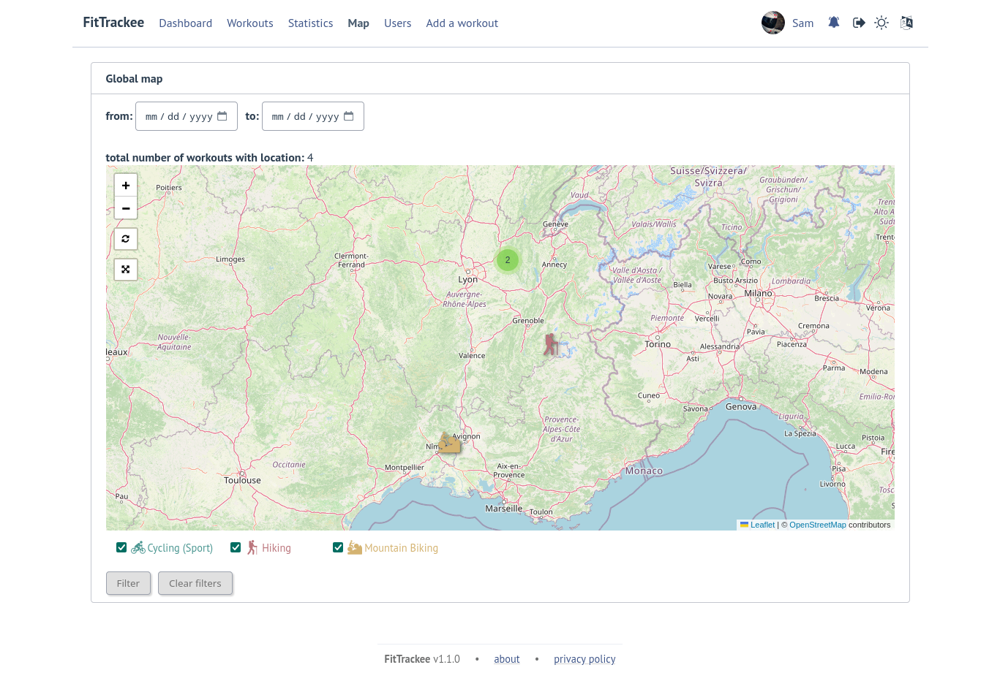

Global map
##########

.. versionadded:: 1.0.0

User workouts can be displayed on a global map and filtered by date and sports.

.. note::
  | If the number of workouts exceeds 3,000, a modal appears to confirm the display. This message can be hidden (this can be changed in the `user preferences <account_and_preferences.html#preferences>`__).
  | Depending on the browser and device used, displaying a large number of workouts may cause browser slowness or errors.