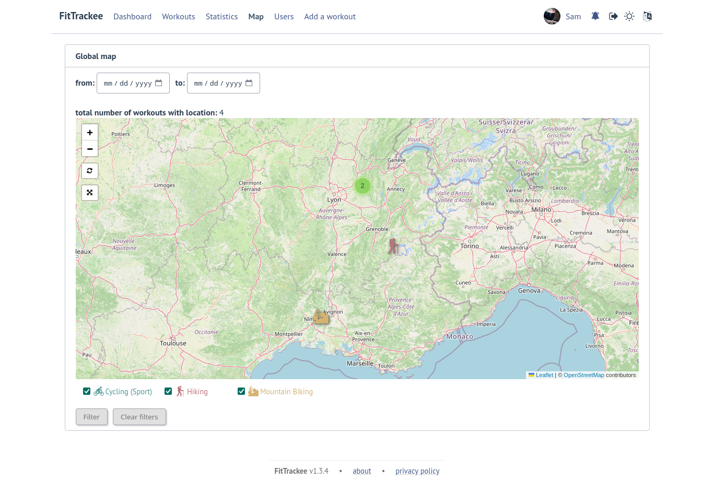

Global map
##########

.. versionadded:: 1.0.0
.. versionchanged:: 1.4.0 added possibility to select a tile layer, when several tile provider are set

User workouts can be displayed on a global map and filtered by date and sports.

.. note::
  | If the number of workouts exceeds 3,000, a modal appears to confirm the display. This message can be hidden (this can be changed in the `user preferences <account_and_preferences.html#preferences>`__).
  | Depending on the browser and device used, displaying a large number of workouts may cause browser slowness or errors.

Heatmap
~~~~~~~

.. versionadded:: 1.4.0

A heatmap can be displayed instead of the workout markers, shading the paths
depending on how many workouts crossed them. It follows the date and sports
filters.

The tracks are stored as the cells of a grid, whose resolution is set with
`HEATMAP_BASE_ZOOM <../installation/environments_variables.html#envvar-HEATMAP_BASE_ZOOM>`__
(cells of about 38 m by default). Cells are merged to match the zoom level,
and merged further on a dense view, so the map stays readable and the response
bounded whatever the number of workouts.

.. note::
  | The heatmap is displayed only if `ENABLE_HEATMAP <../installation/environments_variables.html#envvar-ENABLE_HEATMAP>`__ is set to ``True``.
  | The cells are computed when a workout is created or its file refreshed, and for existing workouts when upgrading.
  | On an instance with a large number of workouts, they can be computed separately with ``ftcli workouts rebuild_heatmap`` (see `CLI <../cli.html#ftcli-workouts-rebuild-heatmap>`__).
