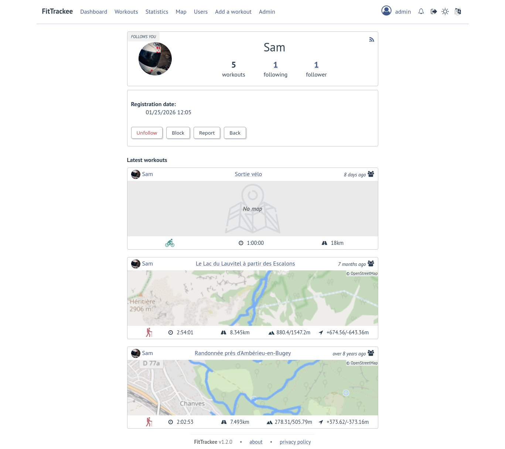

Interactions
############

.. versionadded:: 0.9.0

Users
*****

Users directory
===============

| Users can configure visibility in directory in the `user preferences <account_and_preferences.html#preferences>`__ (hidden profile by default).
| This affects username completion when writing comments (only profiles visible in users directory or followed users are suggested).

.. figure:: ../_images/users-directory.png
   :alt: Users Directory on FitTrackee

.. note::
    A user profile remains accessible via its URL.

User profile
============

.. versionchanged:: 0.9.0 display of the last 5 sessions visible in the user profile
.. versionchanged:: 0.12.0 added RSS Feed
.. versionchanged:: 0.12.1 description added to the RSS Feed

| The user profile displays the last 5 visible workouts.
| The language and imperial units are taken into account according to the user's preferences if logged in.

   On the screenshot only 3 workouts are visible to the authenticated user.

A RSS feed is available in the user profile with the 5 last public workouts (displayed by default in English and using the metric system).

It's possible to specify language and/or imperial units display, for instance:

- ``https://<FITTRACKEE_DOMAIN>/users/<USERNAME>/workouts.rss?lang=fr``
- ``https://<FITTRACKEE_DOMAIN>/users/<USERNAME>/workouts.rss?imperial_units=true``

.. note::
  The rendering of the description may differ from that on FitTrackee, as different libraries are used and additional styles are applied on the UI.

No workouts are displayed when the user is suspended.

Workout description can be displayed by adding ``description`` parameter (not displayed by default):

- ``https://<FITTRACKEE_DOMAIN>/users/<USERNAME>/workouts.rss?description=true``

.. note::
  The RSS feed is not autodiscoverable due to application architecture (client-side rendering).

Follow requests
===============

| The users can send follow request to other users.
| Follow request can be approved or rejected.
| Follow request approval can be manual or automatic (manual by default, see `user preferences <account_and_preferences.html#preferences>`__).

| In order to hide unwanted content, users can block another user.
| Blocking users hides their workouts on timeline and comments. Notifications from blocked users are not displayed.
| Blocked users cannot see workouts and comments from users who have blocked them, or follow them (if they followed them, they are forced to unfollow them).

| Users can report a user profile that violates instance rules. This will send a notification to moderators and administrators.

Comments
********

| Depending on visibility, an authenticated user can comment on a workout.
| A limited Markdown syntax can be used.

.. figure:: ../_images/workout-comment.png
   :alt: User profile on FitTrackee

The visibility levels for comment are:

- private: only author and mentioned users can see the comment,
- followers only: only author, followers and mentioned users can see the comment,
- public: anyone can see the comment even unauthenticated users.

.. important::
  | Please keep in mind that the server operating team or the moderation team may view content with restricted visibility.

.. note::
  | Changing workout visibility will not affect visibility of existing comments.

Comment text can be modified (visibility level cannot be changed).

Users can report a comment that violates instance rules. This will send a notification to moderators and administrators.

Likes
*****

Depending on visibility, users can like or "unlike" a workout or a comment.

The list of users who have liked the workout or comment is available.

Notifications
*************

Notifications are created for the following event:

- follow request and follow
- follow request approval when follow request approval is manual
- like on comment or workout
- comment on workout
- mention on comment
- suspension or warning (an email is also sent if email sending is enabled)
- suspension or warning lifting (an email is also sent if email sending is enabled)

.. figure:: ../_images/notifications.png
   :alt: FitTrackee Notifications

Users with moderation rights can also receive notifications on:

- report creation
- appeal on suspension or warning

Users with administration rights can also receive notifications on user creation.

Users can mark notifications as read or unread.

Notifications can be disabled or enabled the following events in user preferences:

- follow request and follow
- follow request approval when follow request approval is manual
- like on comment or workout
- comment on workout
- mention on comment
- user registration (if authenticated user has administration rights)

Moderation
**********

Comments, workouts, or accounts may be suspended after actions by moderators or administrators, see `Moderation in user account <account_and_preferences.html#moderation>`__.
