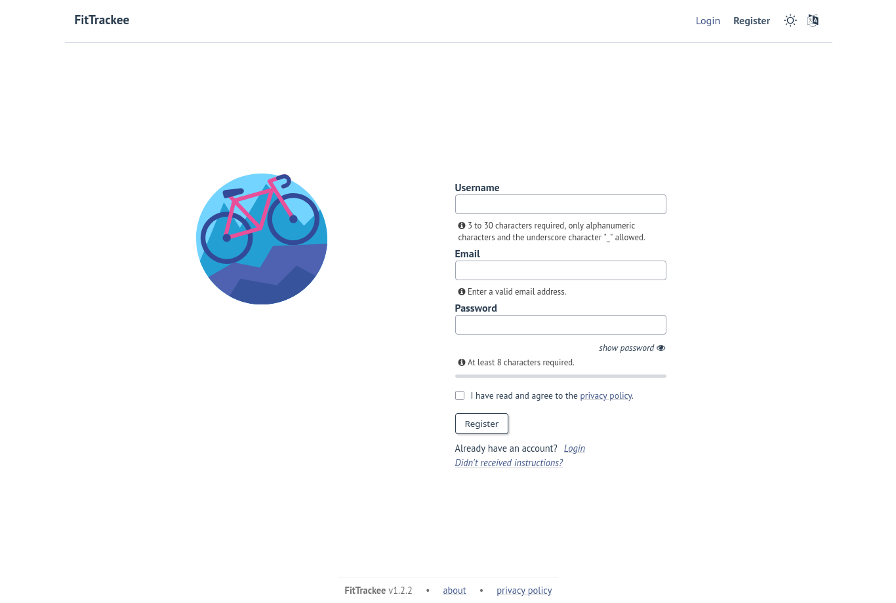

Registration and authentication
###############################

.. versionchanged:: 0.6.0 improve registration process
.. versionchanged:: 0.6.9 create user account with language detected from browser
.. versionchanged:: 0.9.4 create user account with time zone detected from browser
.. versionchanged:: 0.7.13 added privacy policy

If registration is enabled, users can register by providing:

- user name,
- email,
- password.

Tips for strengthening password security are displayed.

| The user must agree to the privacy policy to register.
| If a more recent policy is available, a message is displayed on the dashboard to review the new version.

The user account is created with language if supported and time zone detected from browser.

| After registration, the user account is inactive and an email with confirmation instructions is sent to activate it.
| A user with an inactive account cannot log in.

.. note::
  In case email sending is not configured, a `command line <../cli.html#ftcli-users-update>`__ allows to activate users account.

After account activation, users can log in with email and password.