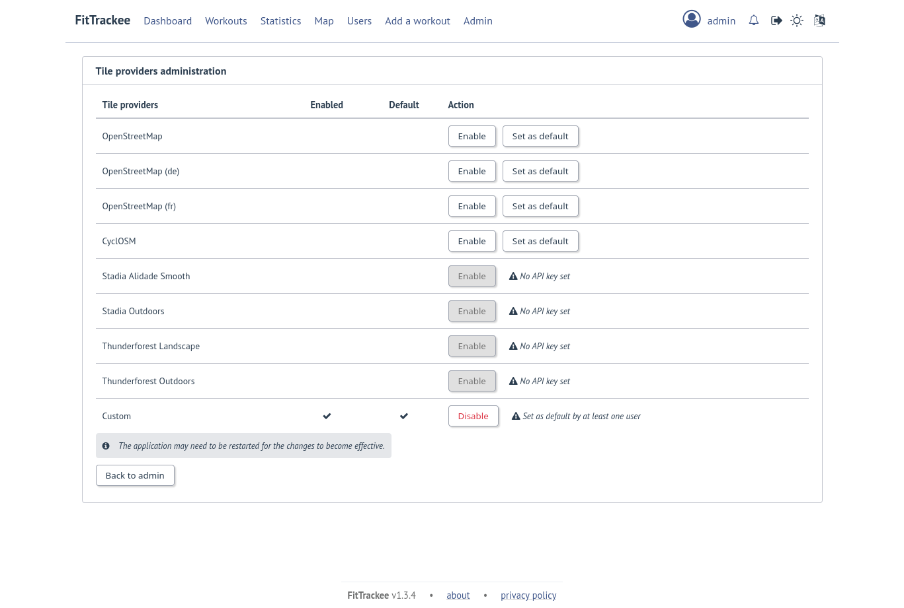

Map tile providers
##################

.. versionadded:: 0.4.0 added possibility to change map tile provider
.. versionchanged:: 0.6.10 handle tile server subdomains
.. versionchanged:: 0.7.23 default tile server (**OpenStreetMap**) no longer requires subdomains
.. versionchanged:: 1.4.0 add possibility to set several tile providers

Tile providers are used to display workouts on map (in Workout details, Workouts list and Global map) and for static map thumbnails generation.

The following tile providers can be set in `Administration <../features/administration.html#tile-providers>`_:

- `OpenStreetMap (Standard tile layer) <https://www.openstreetmap.org/>`__, id: ``osm``
- `OpenStreetMap (German variant of the Standard tile layer) <https://openstreetmap.de/>`__, id: ``osm_de``
- `OpenStreetMap (French variant of the Standard tile layer) <https://www.openstreetmap.fr/fonds-de-carte/>`__, id: ``osm_fr``
- `CyclOSM <https://www.cyclosm.org>`__., id: ``cyclosm``
- `Stadia Maps <https://stadiamaps.com/>`__ (`Alidade Smooth <https://stadiamaps.com/explore-the-map/#style=alidade_smooth>`__ (id ``stadiamaps_alidade_smooth``) and `Outdoors <https://stadiamaps.com/explore-the-map/#style=outdoors>`__ (id ``stadiamaps_outdoors``)). This provider requires an API key (see `STADIAMAPS_API_KEY <environments_variables.html#envvar-STADIAMAPS_API_KEY>`__ )
- `Thunderforest <https://www.thunderforest.com/>`__ (`Landscape <https://www.thunderforest.com/maps/landscape/>`__ (id ``thunderforest_landscape``) and `Outdoors <https://www.thunderforest.com/maps/outdoors/>`__ (id ``thunderforest_outdoors``)). This provider requires an API key (see `THUNDERFOREST_API_KEY <environments_variables.html#envvar-THUNDERFOREST_API_KEY>`__ )

Default tile server is **OpenStreetMap**'s standard tile layer (if environment variables are not initialized).

It is possible to set a custom tile provider (id: ``custom``) by updating the following variables:

- `CUSTOM_TILE_PROVIDER_URL <environments_variables.html#envvar-CUSTOM_TILE_PROVIDER_URL>`__
- `CUSTOM_TILE_PROVIDER_ATTRIBUTION <environments_variables.html#envvar-CUSTOM_TILE_PROVIDER_ATTRIBUTION>`__
- `CUSTOM_TILE_PROVIDER_SUBDOMAINS <environments_variables.html#envvar-CUSTOM_TILE_PROVIDER_SUBDOMAINS>`__

.. note::
    | Check the terms of service of tile provider for map attribution.

(see `list of tile servers <https://wiki.openstreetmap.org/wiki/Raster_tile_providers>`__).

.. warning::
    | The previous variables have been deprecated and will be removed in a next version:
    | - `TILE_SERVER_URL <environments_variables.html#envvar-TILE_SERVER_URL>`__
    | - `MAP_ATTRIBUTION <environments_variables.html#envvar-MAP_ATTRIBUTION>`__
    | - `STATICMAP_SUBDOMAINS <environments_variables.html#envvar-STATICMAP_SUBDOMAINS>`__
    | If a tile provider was set before v1.4.0, it is preserved as a custom tile provider.
